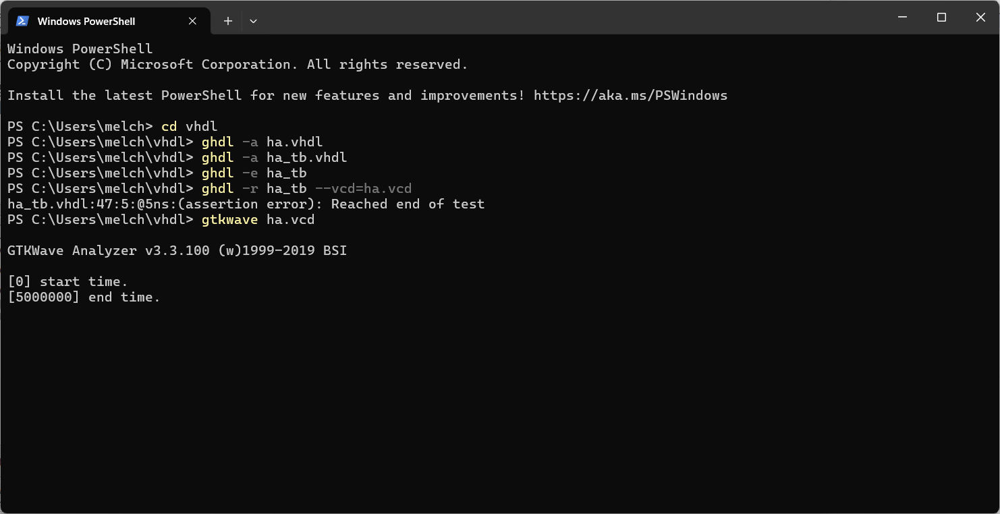
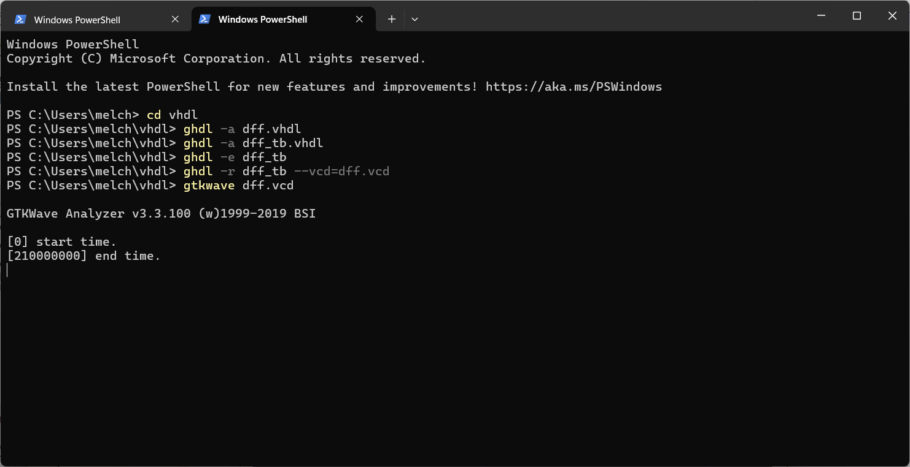
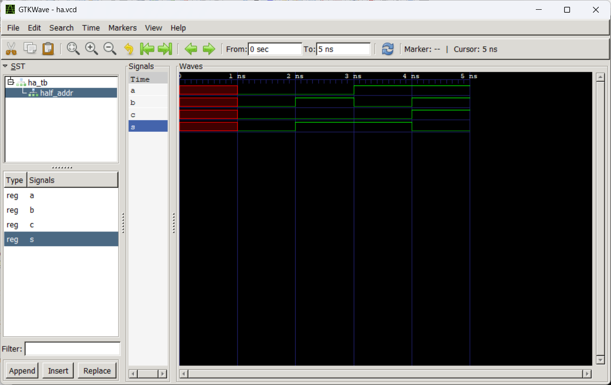

# Lab 1 - GHDL and GTKWave

## Instructions

- Go to the [GitHub repository](https://github.com/kevinwlu/dsd) of Digital System Design (DSD)
- Go to the [GHDL](https://github.com/kevinwlu/dsd/tree/master/ghdl) folder
  - Install GHDL and GTKWave
  - Run the Half Adder example
  - Run another example such as D Flip-Flop or 4-to-1 Multiplexer
  - Document the results on your GitHub repository

## Half Adder

## D Flip Flop

## Summary
In this lab, I learned how to install and use GHDL and GTKWave, two essential tools for simulating and debugging digital circuits. GHDL compiles VHDL files—used to describe digital circuit behavior—into machine code, while GTKWave provides a visual interface to observe circuit activity. Together, these tools support hardware design, testing, documentation, and verification.
