# Lab 2 - Command Line

## Instructions

- Go to the [IoT repository](https://github.com/kevinwlu/iot) 
- Go to Lessons 1 and 2
- Open a terminal

## $ hostname
displays the computer's network host name

## $ env
displays the computer's environment variables

## $ ps
displays information about running processes on the computer

## $ pwd
display the full path of the current directory you are located in

## $ git clone https://github.com/kevinwlu/iot.git
makes a copy of the git repository that is located at the specified website

## $ cd iot
changes the working directory to IOT

## $ ls
displays a list of all files in the current directory besides hidden files

## $ cd
change directories to your home directory
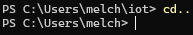

## $ df
displays information about disk space on a file system
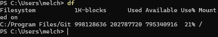

## $ mkdir demo
makes a new directory called demo

## $ cd demo
changes the working directory to demo
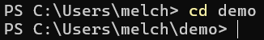

## $ nano file
In the nano file I pu "xx"
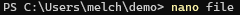

## $ cat file
display the contents of 'file'
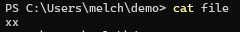

## $ cp file file1
copies the contents of file into file1
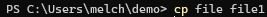

## $ mv file file2
moves (or renames) file to file2
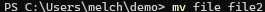

## $ rm file2
 removes (deletes) file2
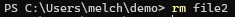

## $ clear
clear all content on the terminal screen

## $ man uname

## $ uname -a
displays detailed system information in a single line
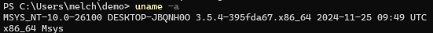

## $ ipconfig
provides a comprehensive list of all network interfaces along with their respective IP addresses, MAC addresses, and other relevant details

## $ ping localhost
sends network packets to your own machine to check if the network stack is functioning properly
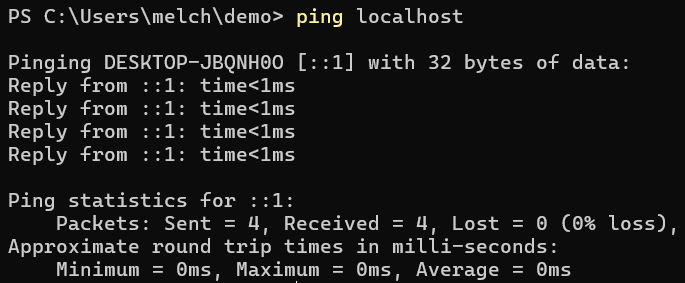

## $ netstat
displays information about your network connections, including active TCP connections, listening ports, routing table details, and network interface statistics
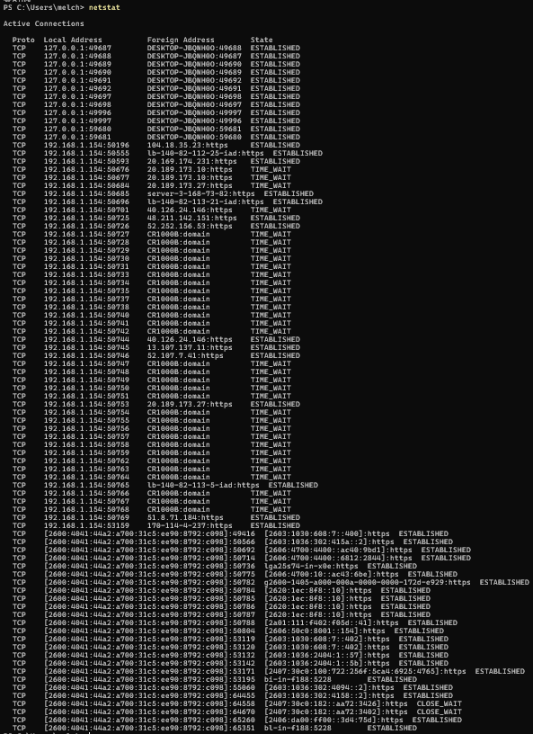

## Summary
This lab introduced essential terminal commands. Through completing it, I gained hands-on experience with commands related to system information, process and directory management, file operations, networking, and Git version control.
