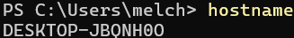
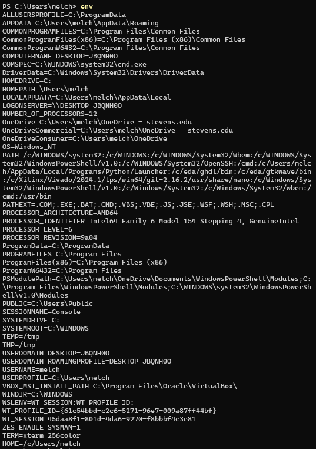
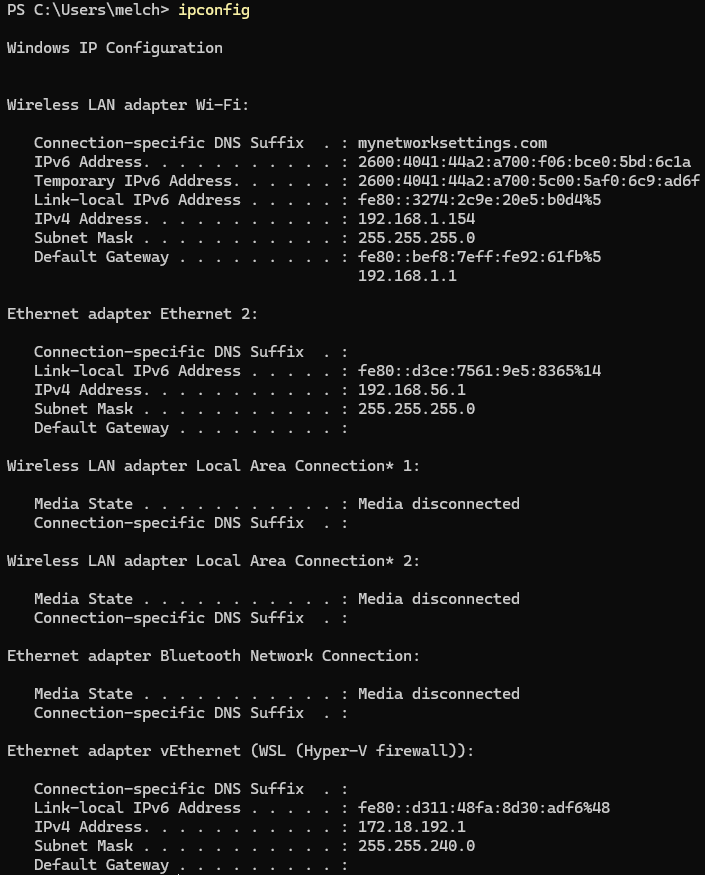

# Lab 2 - Command Line

## Instructions

- Go to the [IoT repository](https://github.com/kevinwlu/iot) 
- Go to Lessons 1 and 2
- Open a terminal

## $ hostname

## $ env

## $ ps

## $ pwd

## $ git clone https://github.com/kevinwlu/iot.git

## $ cd iot

## $ ls

## $ cd

## $ df

## $ mkdir demo

## $ cd demo

## $ nano file
In the nano file I pu "xx"

## $ cat file

## $ cp file file1

## $ mv file file2

## $ rm file2

## $ clear

## $ man uname

## $ uname -a

## $ ipconfig

## $ ping localhost

## $ netstat

## Summary
In this lab, I learned how to install and use GHDL and GTKWave, two essential tools for simulating and debugging digital circuits. GHDL compiles VHDL files—used to describe digital circuit behavior—into machine code, while GTKWave provides a visual interface to observe circuit activity. Together, these tools support hardware design, testing, documentation, and verification.

