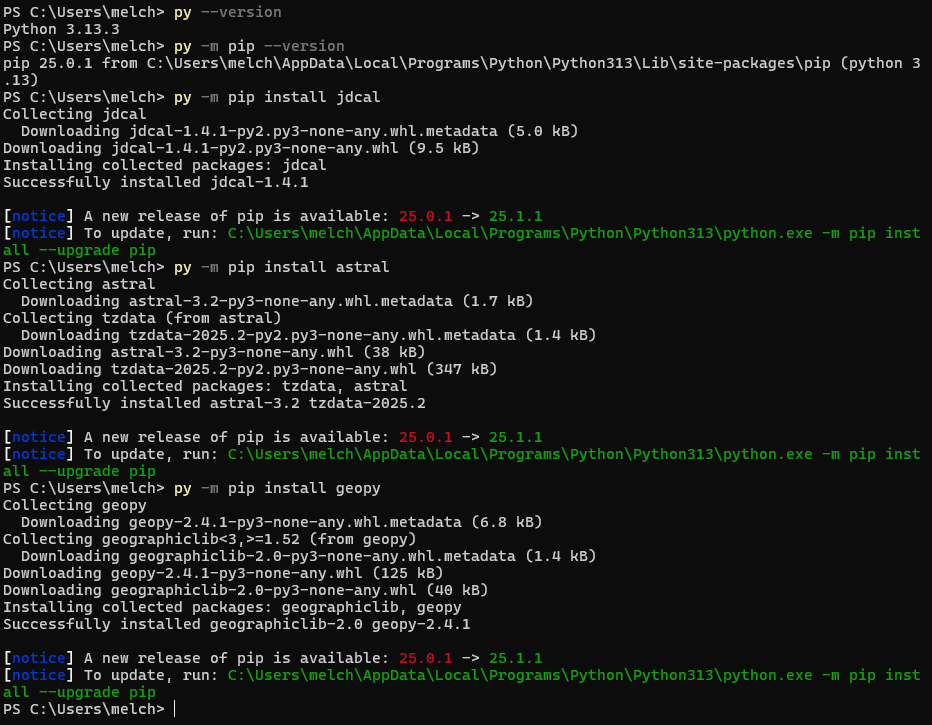

# Lab 3 - Python

## Instructions

- Go to the [repository](https://github.com/kevinwlu/iot) 
- Go to Lessons 3
- Install required Python packages such as jdcal, astral, and geopy

## Install
I installed using the Python launcher becuase I was having issues

## Summary
