# Lab 3 - Python

## Instructions

- Go to the [repository](https://github.com/kevinwlu/iot) 
- Go to Lesson 3
- Install required Python packages such as jdcal, astral, and geopy

## Install
I installed using the Python launcher because I was having issues

## $ cd ~/iot
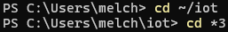

## $ cd *3
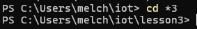

## $ python3 julian.py
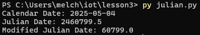

## $ python3 date_example.py
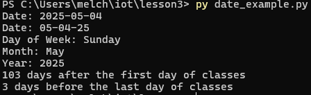

## $ python3 datetime_example.py
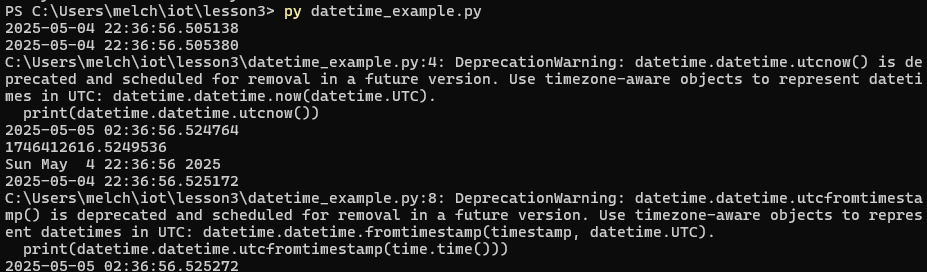

## python3 time_example.py
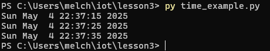

## $ python3 sun.py "New York"
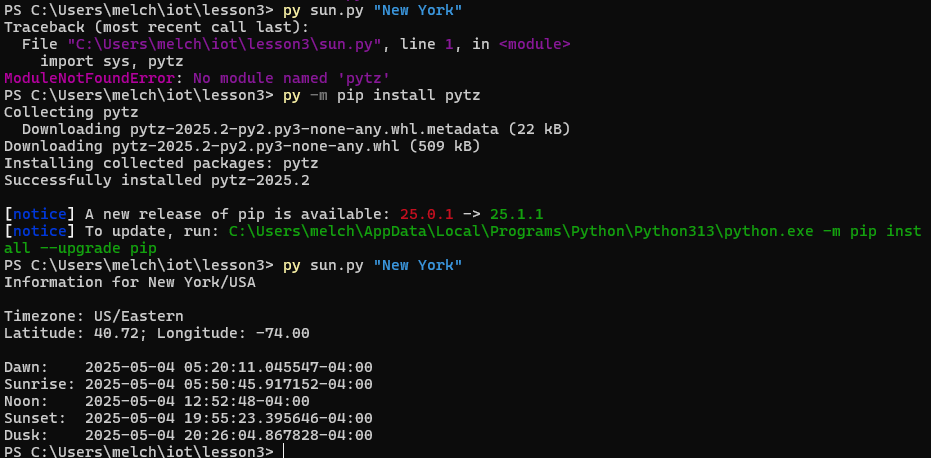

## $ python3 moon.py
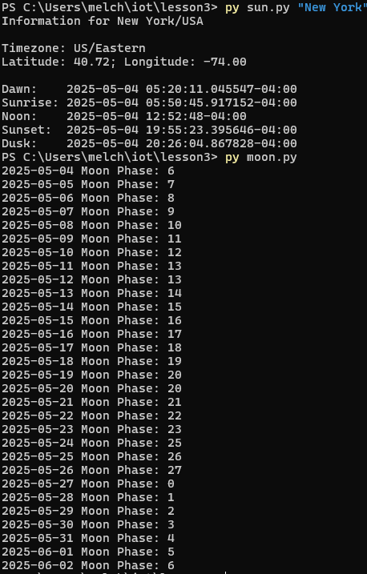

## $ python3 coordinates.py "Samuel C. Williams Library"
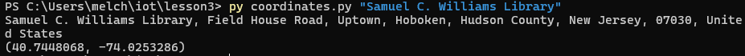

## $ python3 address.py "40.74480675, -74.02532861159351"

## $ python3 cpu.py
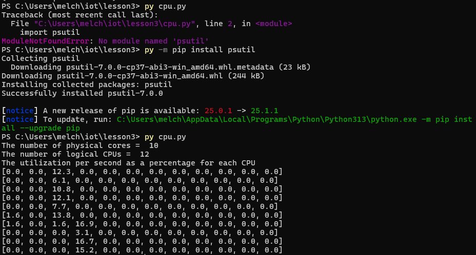

## $ python3 battery.py
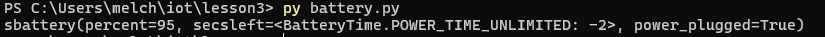

## $ python3 documentstats.py document.txt
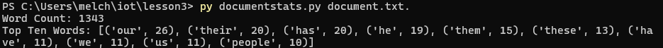

## Summary
