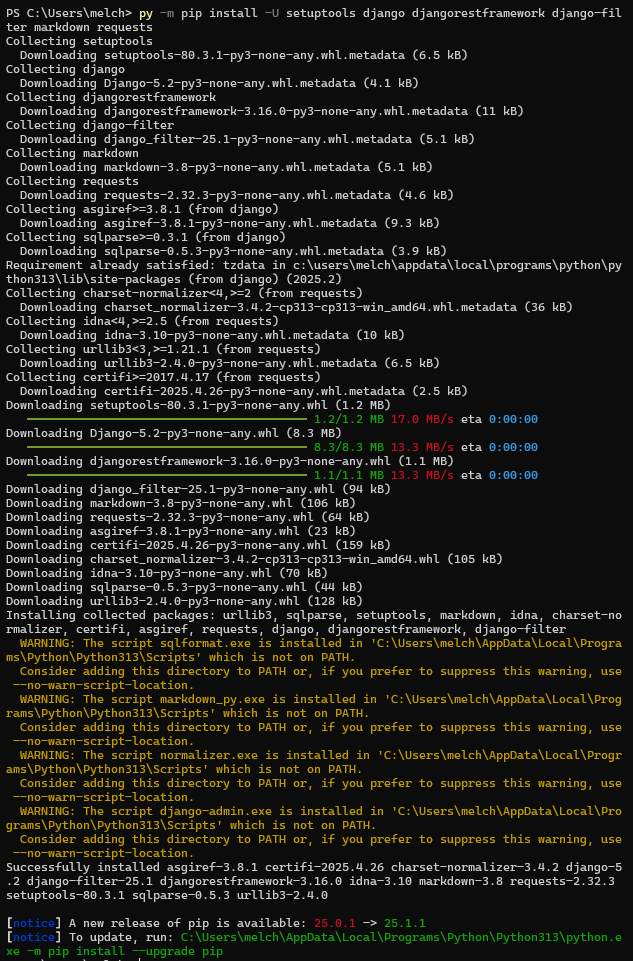

# Lab 4 - Django and Flask

## Instructions

- Go to the [repository](https://github.com/kevinwlu/iot) 
- Go to Lesson 3
- Install required Python packages such as jdcal, astral, and geopy

## Install
I installed using the Python launcher because I was having issues

## $ cd ~/iot

## $ cd *3
