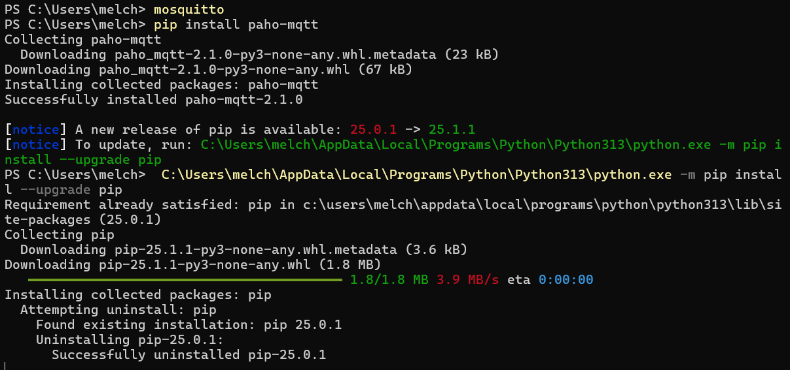
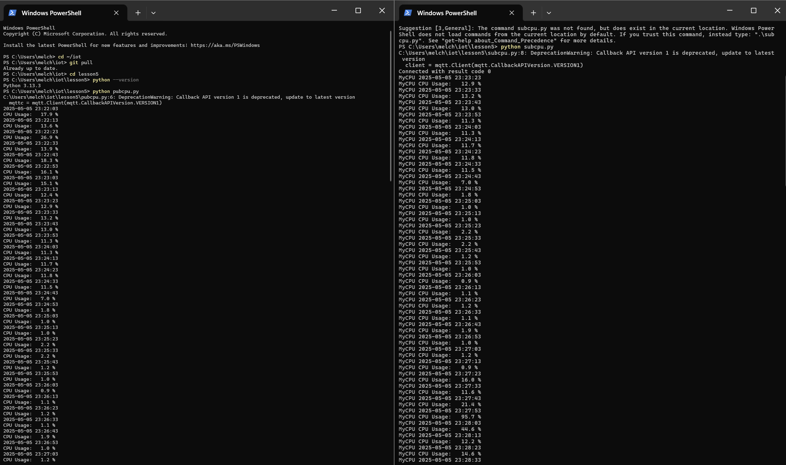

# Lab 5 - Paho-MQTT

## Instructions

- Go to the GitHub repository Lesson 5
- Install Paho-MQTT
- Change directory to the iot repository
- Update the repository with git pull
- Change directory to Lesson 5
- Run python3 subcpu.py on one Terminal
- Run python3 pubcpu.py on another

## Install
py -m pip install -U setuptools django djangorestframework django-filter markdown requests

## Set Up Terminal and Run Script
One terminal I ran the command python pubcpu.py and in the other I ran python subcpu.py. Running these commands resulted in the terminal executing pubcpu.py publishing CPU-related data, while the terminal running subcpu.py subscribed to it and displayed the received data.

## Summary
In this lab I learned how to use paho-mqtt to publish messages from the terminal and how to subscribe one terminal to another.
