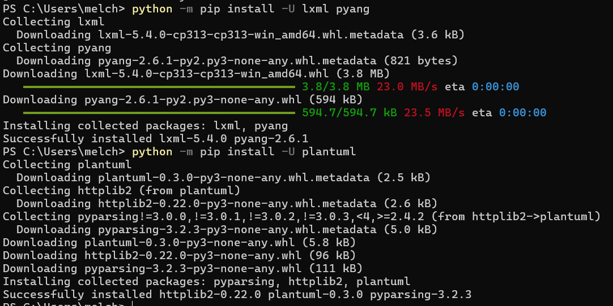
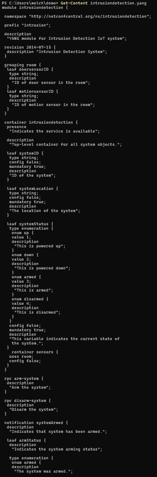
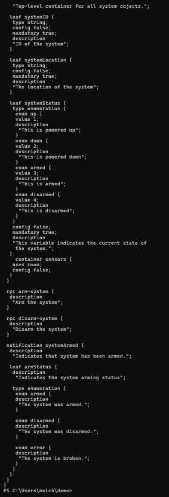
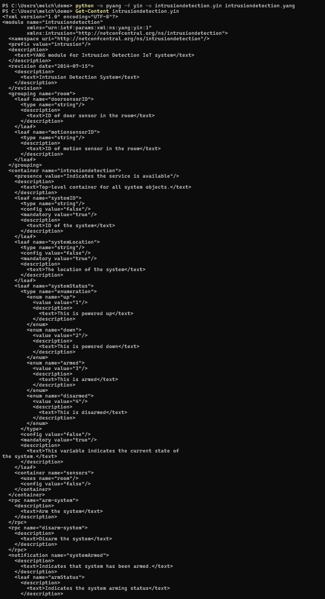
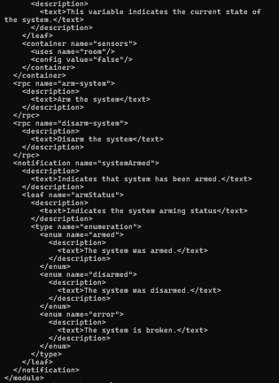
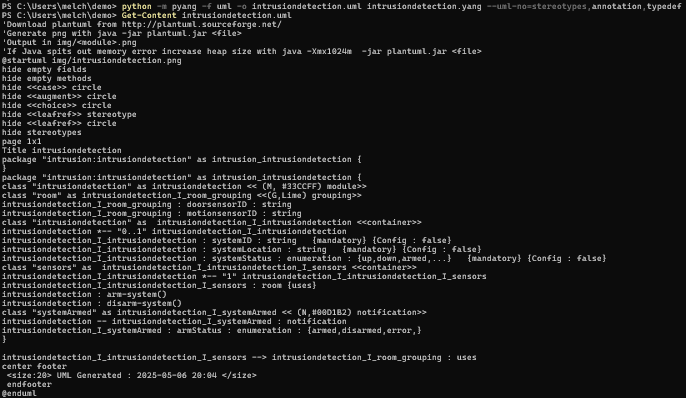
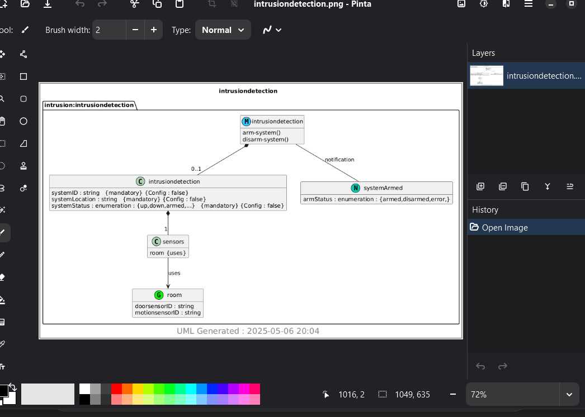
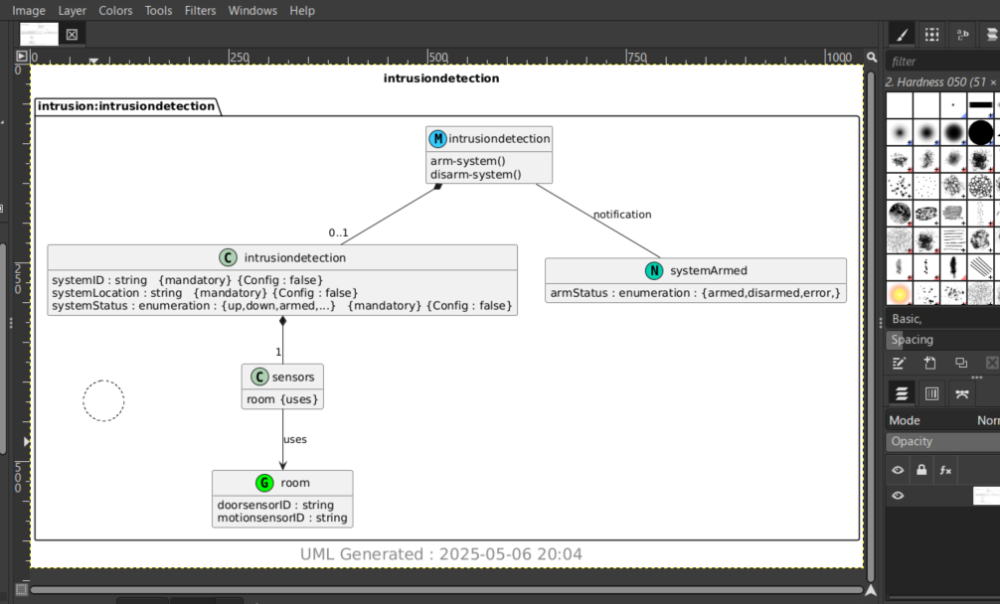

# Lab 9 - YANG

## Instructions

- Go to the GitHub repository Lesson 9
- Install pyang and PlantUML
- copy ~/iot/lesson9/intrusiondetection.yang to ~/demo
- Run pyang to generate intrusiondetection.yin and intrusiondetection.uml
- Run PlantUML to generate intrusiondetection.png

## Install
'''
python - m pip install -U lxml pyang
python -m pip install -U plantuml
'''

## Pyang
copied intrusiondetection.yang into demo & switched to the demo directory with:
'''
Copy-Item "$HOME\iot\lesson9\intrusiondetection.yang" -Destination "$HOME\demo"
Set-Location "$HOME\demo"
'''
Then I executed the following commands to generate intrusiondetection.yin & intrusiondetection.uml while also showing the instrustiondetection file in .yang, .yin, and .uml forms.
'''
Get-Content intrusiondetection.yang
py -m pyang -f yin -o intrusiondetection.yin intrusiondetection.yang
Get-Content intrusiondetection.yin
py -m pyang -f uml -o intrusiondetection.uml intrusiondetection.yang --uml-no=stereotypes,annotation,typedef
Get-Content intrusiondetection.uml
'''

## PlantUML
Run the command 'python -m plantuml intrusiondetection.uml' to create a sequence diagram in PNG format. Then I installed & ran GIMP and Pinta in order to display the PNG file. Downloaded Pinta and added it to my PATH. Downloaded Chocolatey and Gimp through admin powershell.
'''
choco install gimp pinta -y
Start-Process "C:\Program Files\Pinta\bin\Pinta.exe" "$HOME\demo\intrusiondetection.png"
Start-Process "C:\Users\melch\AppData\Local\Programs\GIMP 3\bin\gimp.exe" "$HOME\demo\intrusiondetection.png"
'''

## Summary
In this lab, I explored how a file appears in .yang, .yin, .uml, and .png formats. I found that Pyang is a useful tool for converting YANG models to YIN or UML formats, while PlantUML is great for generating PNG images and diagrams from UML files.
